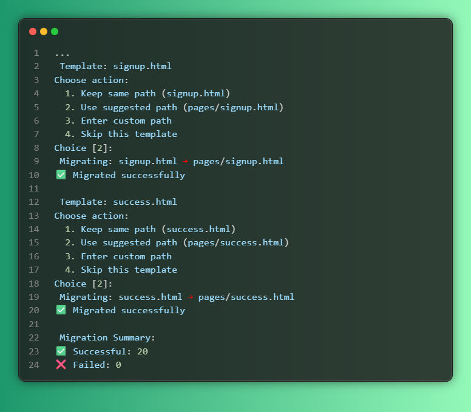

# Jinja Template Migrator



Interactive CLI tool for migrating Jinja templates to new design layouts. Automatically analyzes your existing templates and helps you reorganize them with new structure, variable names, and block mappings.

## Features

- **Smart Analysis** - Automatically discovers variables, blocks, and template structure using Jinja2 AST
- **Interactive Mapping** - Configure variable and block mappings on-the-fly
- **Flexible Paths** - Choose new file locations with intelligent suggestions
- **Auto Mode** - Fully automated migration with sensible defaults
- **Dry Run** - Preview changes before applying them
- **Migration Reports** - Detailed reports of all changes made

## Installation

```bash
pip install -r requirements.txt
```

## Quick Start

1. **Create config file:**
```bash
python migrator.py --config migration_config.yaml
```

2. **Edit the generated config** to set your source/target directories

3. **Run migration:**
```bash
# Interactive mode
python migrator.py

# Auto mode (no prompts)
python migrator.py --auto

# Preview changes first
python migrator.py --dry-run
```

## Usage Examples

```bash
# Basic migration with interaction
python migrator.py

# Migrate specific templates
python migrator.py -t index.html -t user/profile.html

# Automatic migration with report
python migrator.py --auto --report

# Preview what would change
python migrator.py --dry-run
```

## Configuration

Simple YAML config with minimal required settings:

```yaml
source_dir: "./old_templates"
target_dir: "./new_templates"
new_base_template: "layouts/base.html"
exclude_patterns:
  - ".*_backup\\.html$"
  - "temp_.*\\.html$"
auto_preserve_blocks: true
auto_map_variables: false
```

## How It Works

1. **Discovery** - Scans all templates to find variables and blocks
2. **Mapping** - Interactively or automatically maps old names to new ones
3. **Path Selection** - Choose new file locations for each template
4. **Migration** - Generates new templates with updated structure
5. **Reporting** - Creates detailed migration report

## Interactive Features

### Template Paths
For each template, choose:
- Keep same path
- Use suggested path (e.g., `index.html` → `pages/index.html`)
- Enter custom path
- Skip template

### Variable Mapping
- Review all discovered variables
- Rename as needed (e.g., `user_name` → `username`)
- Auto-suggestions for common patterns

### Block Mapping
- Preserve important blocks
- Rename blocks (e.g., `content` → `main_content`)
- Automatic mapping for common block names

## Auto Mode

Use `--auto` flag for fully automated migration:
- Applies sensible path suggestions
- Uses common variable name mappings
- Preserves all blocks with standard renames
- No user interaction required

## Output

Migrated templates include:
- New `extends` directive
- Preserved blocks with new names
- Updated variable references
- Migration comments for tracking

## License
Generated with Sonnet4

MIT License
